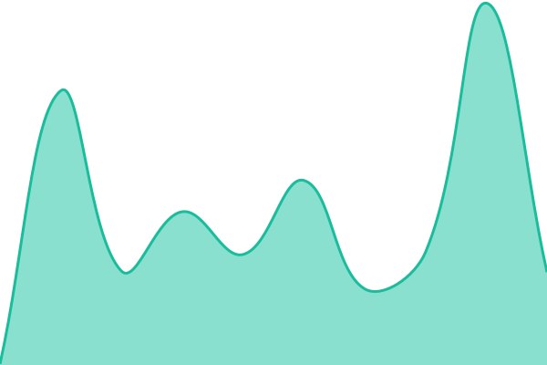

# [📈 Live Status](https://Subject-Team.github.io/uptime): <!--live status--> **🟩 All systems operational**

This repository contains the open-source uptime monitor and status page for [Subject Team](https://Subject-Team.github.io/uptime), powered by [Upptime](https://github.com/upptime/upptime).

With [Upptime](https://upptime.js.org), you can get your own unlimited and free uptime monitor and status page, powered entirely by a GitHub repository. We use [Issues](https://github.com/Subject-Team/uptime/issues) as incident reports, [Actions](https://github.com/Subject-Team/uptime/actions) as uptime monitors, and [Pages](https://Subject-Team.github.io/uptime) for the status page.

<!--start: status pages-->
<!-- This summary is generated by Upptime (https://github.com/upptime/upptime) -->
<!-- Do not edit this manually, your changes will be overwritten -->
<!-- prettier-ignore -->
| URL | Status | History | Response Time | Uptime |
| --- | ------ | ------- | ------------- | ------ |
|  Router 1 | 🟩 Up | [router-1.yml](https://github.com/Subject-Team/uptime/commits/HEAD/history/router-1.yml) | 

 455ms
     
 | 

<a href="https://Subject-Team.github.io/uptime/history/router-1">100.00%</a>
    

|  Backend 1 | 🟩 Up | [backend-1.yml](https://github.com/Subject-Team/uptime/commits/HEAD/history/backend-1.yml) | 

 132ms
     
 | 

<a href="https://Subject-Team.github.io/uptime/history/backend-1">100.00%</a>
    

|  Frontend 1 | 🟩 Up | [frontend-1.yml](https://github.com/Subject-Team/uptime/commits/HEAD/history/frontend-1.yml) | 

 127ms
     
 | 

<a href="https://Subject-Team.github.io/uptime/history/frontend-1">100.00%</a>
    

<!--end: status pages-->

[**Visit our status website →**](https://Subject-Team.github.io/uptime)

## 📄 License

- Powered by: [Upptime](https://github.com/upptime/upptime)
- Code: [MIT](./LICENSE) © [Anand Chowdhary](https://anandchowdhary.com)
- Data in the `./history` directory: [Open Database License](https://opendatacommons.org/licenses/odbl/1-0/)
